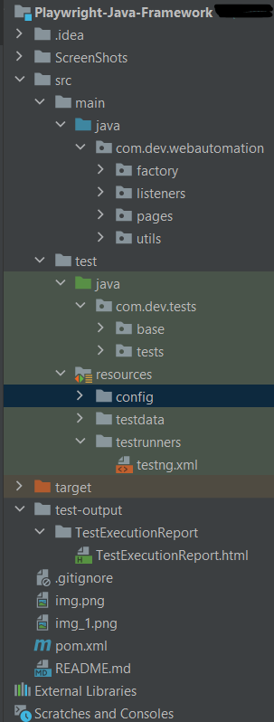
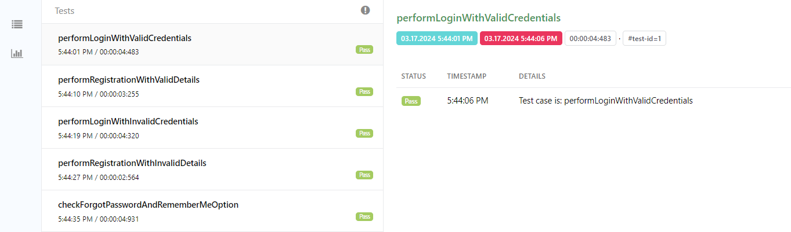
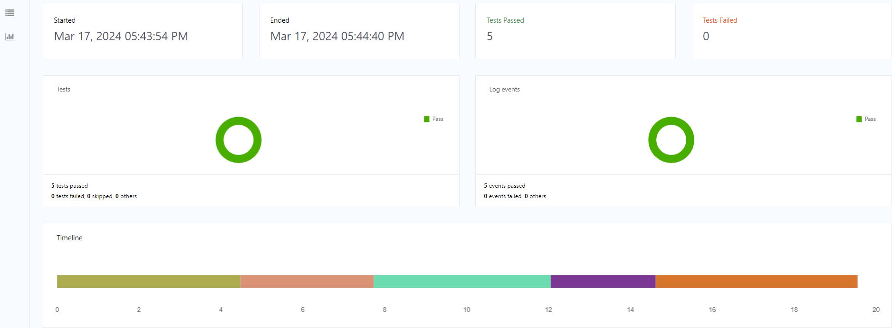

# Playwright Java Automation Framework

This is a web automation framework using Playwright with Java, Maven, TestNG and ExtentReports for browser automation testing.
Playwright is a powerful tool for automating interactions with web browsers, and this framework provides a structured approach to writing and running browser tests in Java.

# Prerequisites

Before running the tests, ensure you have the following dependencies installed:

1. The Playwright Java library

2. Java Development Kit (JDK) version 11 or later

3. Apache Maven

4. TestNg

5. IntelliJ IDEA (or any other Java IDE)

# Framework Structure

# Framework Features:

Modular architecture using the Page Object Model design pattern

Support for multiple browsers (chromium, Firefox and webkit)

Configuration using properties file

Test data driving using excel (Fillo library )

Test Reporting using ExtentReports

# How to run the tests:

1. Clone the repository(https://github.com/devqa07/PlaywrightJavaAutomationFramework.git) from GitHub

2. Install the required software/dependencies and bindings

3. Open the project in your preferred IDE (e.g. IntelliJ IDEA or Eclipse).

4. Modify the config.properties file in the src/test/resources directory to run the tests in chrome, firefox and microsoft edge browsers.

5. We can run the individual tests from src/test/java/com.dev.tests.tests package or Simply run mvn test command from commandline, also complete suite can be executed with testng.xml.

6. After test execution, test reports can be viewed in the /test-output/TestExecutionReport/TestExecutionReport.html directory.

